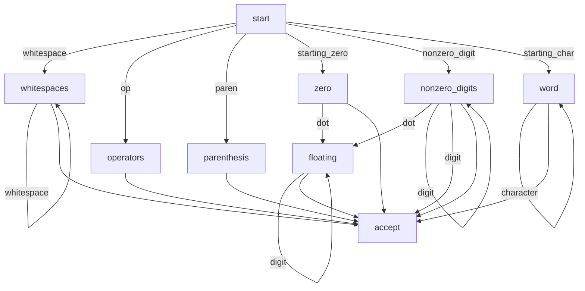

# Calculator on RDP
This is a command-line calculator implemented on recursive descent parser(RDP).
Purpose of the project is practicing RDP rather than making useful calculator.
I tried to write the RDP code following some rules as strict as possible hoping for automatic generation of the RDP code in the future.

## Tokenizer
Useful concepts for understanding and implementing tokenizer(or lexer or scanner).

### Finite-state Machine
FSM is defined by
- finite set of state
- finite characters
- transition function
- starting state
- accepting state

### Table-based Scanner
- Character classifier table 

    defines category of characters.
    e.g) \*, +, -, / belong to operator, alphabet belong to alphabet.
- Transition table

    Map a pair of a state and a character to next state.
- Token type table

    One of the token types is assigned to an acquired token.

## Transition Diagram

### States
- whitespaces
- operators
- parenthesis
- zero
- nonzero_digits
- floating
- word
- error

### Types of characters
- whitespace
- paren
- op (=|+|-|\*|/)
- starting_zero ^0
- nonzero_digit [1-9]
- digit [0-9]
- dot .
- starting_char ^([a-z]|[A-Z]|\_)
- character [a-z]|[A-Z]|[0-9]|\_)
- invalid


A state -- a type of character --> next state


## Parser

### BNF for parsing rules
lowercase entry is non-terminal and uppercase entry is terminal.
terminal is represented in either string or regular expression.
```
input           : linebreak
                | assignment LINEBREAK // v2 feature
                | equation LINEBREAK
                | expression LINEBREAK
                ;
assignment      : VARIABLE '=' expression
                ;
equation        : expression '=' expression
                ;
expression      : term
                | additive_exp
                ;
additive_exp    : multiple_exp ADDITIVE_OP additive_exp
                | multiple_exp
                ;
multiple_exp    : power MULTIPLE_OP multiple_exp
                | power 
                ;
power           : term '^' power
                | term
                ;
term            : '(' term ')'
                | '(' UNARY_OP term ')'
                | '(' expression ')'
                | NUMBER
                | VARIABLE
                | function
                ;
function        : trigonometric // v2 feature
                ;
trigonometric   : 'cos(' expression ')'
                | 'sin(' expression ')'
                | 'tan(' expression ')'
                ;
UNARY_OP        : '+'
                | '-'
                ;
ADDITIVE_OP     : '+'
                | '-'
                ;
MULTIPLE_OP     : '*'
                | '/'
                ;
NUMBER          : (0|[1-9][0-9]*)           // integer
                | ([1-9][0-9]*|0).[0-9]*    // float
                ;
VARIABLE        : ([a-z]|[A-Z]|_)([0-9]|[a-z]|[A-Z]|_)*
                ;
LINEBREAK       : NEWLINE
                ;
```
### Bugfix
- removed Cycle: term -> function -> power -> term

## Reference
Engineering a compiler by Kenith D. Cooper
