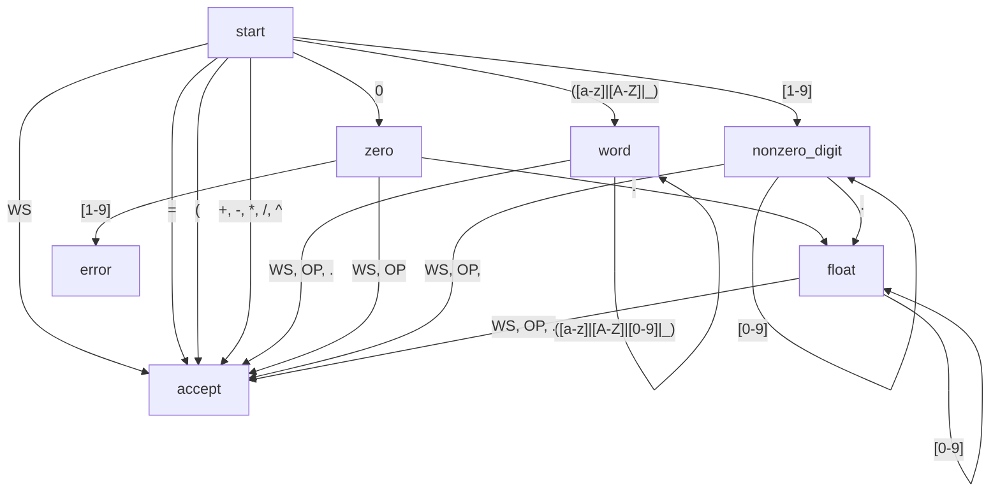

## Finite-state Machine
FSM is defined by
- finite set of state
- finite characters
- transition function
- starting state
- accepting state

### State
- empty
- equality
- parenthesis
- operator
- function
- number
- word

### Types of characters
- whitespaces
- equal sign
- parenthesis
- operators
- function
- number
- word(combination of alphabet and underscore)

## Tokenizer

### Table-based Scanner
- Character classifier table
- Transition table
- Token type table

## Transition Diagram

