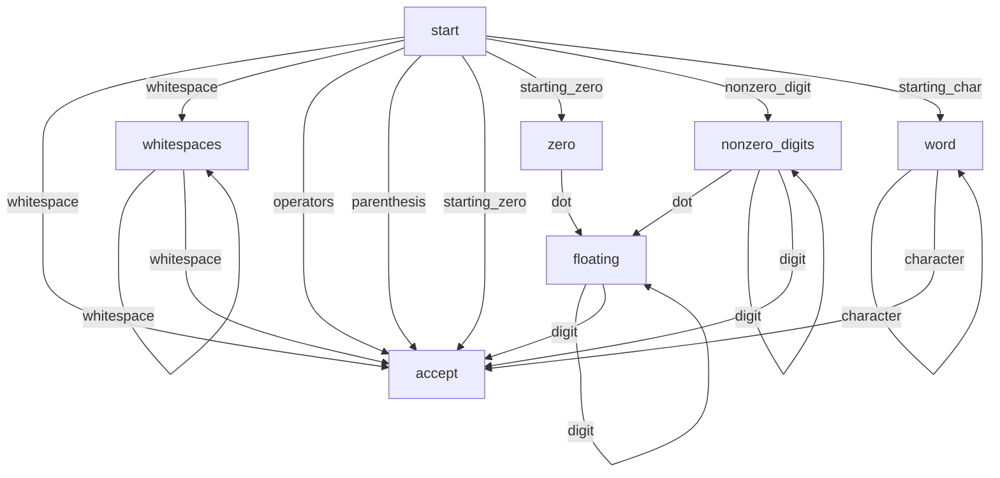

## Finite-state Machine
FSM is defined by
- finite set of state
- finite characters
- transition function
- starting state
- accepting state

## Tokenizer

### Table-based Scanner
- Character classifier table
- Transition table
- Token type table

## Transition Diagram

### States
- start
- accept
- whitespaces
- zero
- nonzero_digits
- floating
- word

### Types of characters
- whitespace
- parenthesis
- operators (=|+|-|\*|/)
- starting_zero ^0
- nonzero_digit [1-9]
- digit [0-9]
- dot .
- starting_char ^([a-z]|[A-Z]|\_)
- character [a-z]|[A-Z]|[0-9]|\_)
- invalid

